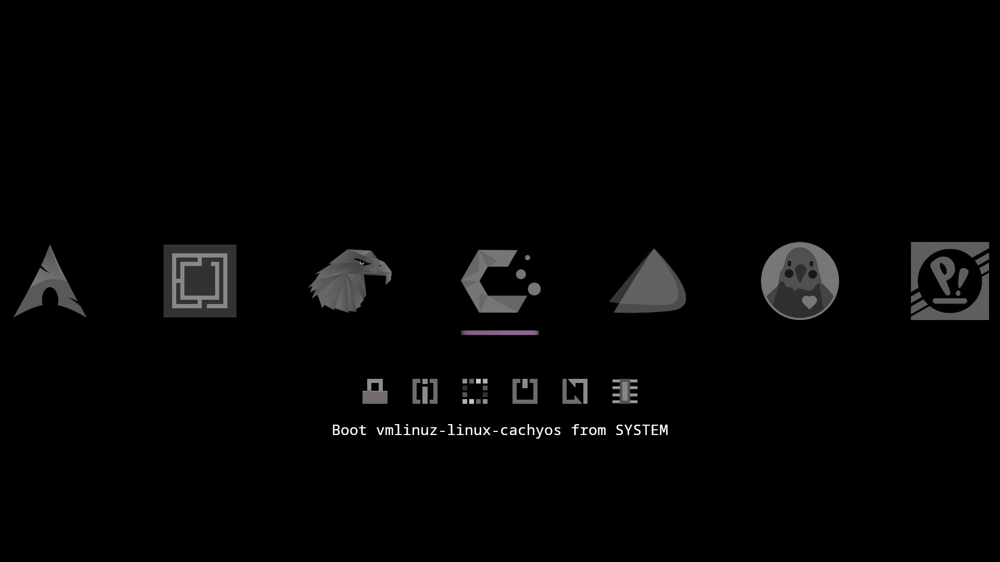
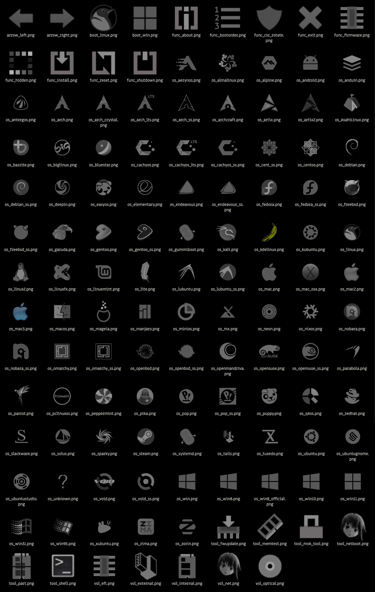
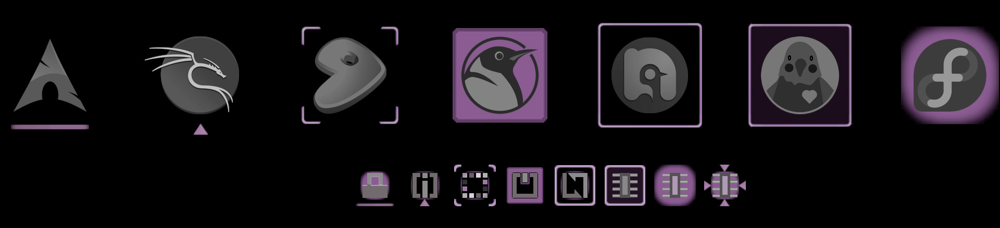

# rEFInd OLED No Blind Me

A less bright theme for the rEFInd Boot Manager

Large icons for 60+ distros are included. There are additional, even more minimalist icons for some distros that can be paired with a refind-btrfs snapshot.

### Installation

Copy the theme folder to a `themes` directory inside the refind EFI directory (usually `/boot/EFI/refind`)

**Example**
>                                               
	sudo mkdir /boot/EFI/refind/themes                        (ignore command or error if directory exists)
	sudo cp -r ./RONBM /boot/EFI/refind/themes/				  (right click to open terminal in downloads folder)

Then add `include themes/RONBM/theme.conf` at the end of /boot/EFI/refind/refind.conf
>

	sudo nano /boot/EFI/refind/refind.conf                    (ctrl+u to paste, ctrl+s to save, ctrl+x to exit)

### Customization

Open /RONBM/theme.conf and follow directions to edit:

* Show/hide label text (shown by default, this is the text in the preview that describes the highlighted icon)
* Show/hide hints (hidden by default, additional instructive text at the bottom of the screen)
* Show/hide badges (hidden by default, small additional icons mark images as internal storage/external/optical/net)
* Icon size (256px default size relatively large for refind, but not very big on a HiDPI monitor)
* Maximum number of icons shown (default 7 should fit like the preview on a 1920 pixel wide monitor)
* Timeout before automatic boot
* Indicator style (there are 8 options of indicator for both large and small icons)

The 'color_icons' folder contains darkened icons with slightly muted colors. If that's your preference, copy it into the icons folder to overwrite the monochrome icons. 

### Setting Custom Icons

If the specific icon isn't automatically applied for a distro, refer to the [rEFInd documentation](https://www.rodsbooks.com/refind/configfile.html) for the seven different ways icons can be set for auto-detected boot loaders.

The icon can also be set with a fixed boot stanza in '/boot/EFI/refind/refind.conf'

**Example**
>

	menuentry " ****** " {                                      (replace ****** with OS name)
		icon /EFI/refind/themes/RONBM/icons/******.png          (replace ****** with icon name)
	    loader /vmlinuz-linux-******                            (replace ****** to match file name in /boot )
	    initrd /initramfs-linux-******.img                      (replace ****** to match file name in /boot )
	    options "quiet ******"                                  (replace "quiet ******" with boot options)
	    }
    
Boot options may be found in refind_linux.conf (sudo nano /boot/refind_linux.conf).   After booting into an OS copy the long string in quotes after "Boot with standard options"

### Setting rEFInd-btfrs Custom Icon

Icons with the Btfrs logo and monochrome versions of distro logos are included for refind-btfrs snapshots.  To set one as a custom icon edit '/etc/refind-btfrs.conf'
>
	
	[boot-stanza-generation.icon]
	mode = "custom" 
	path = "themes/RONBM/icons/os_arch_ss.png"
